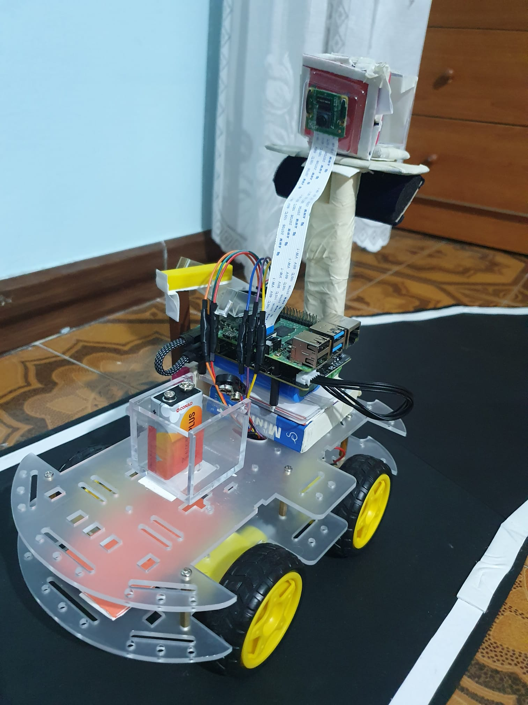
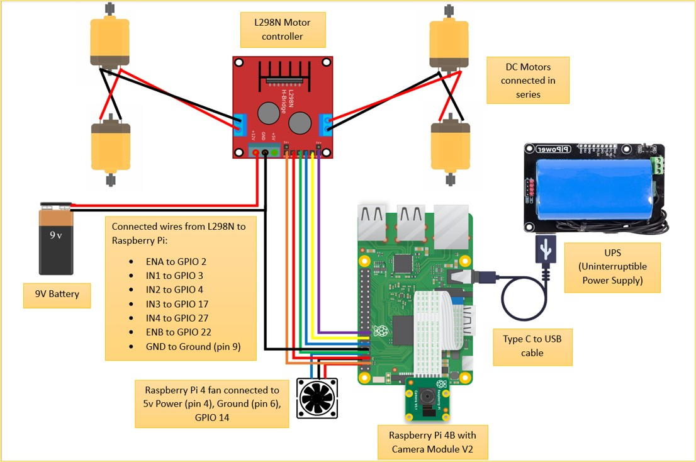
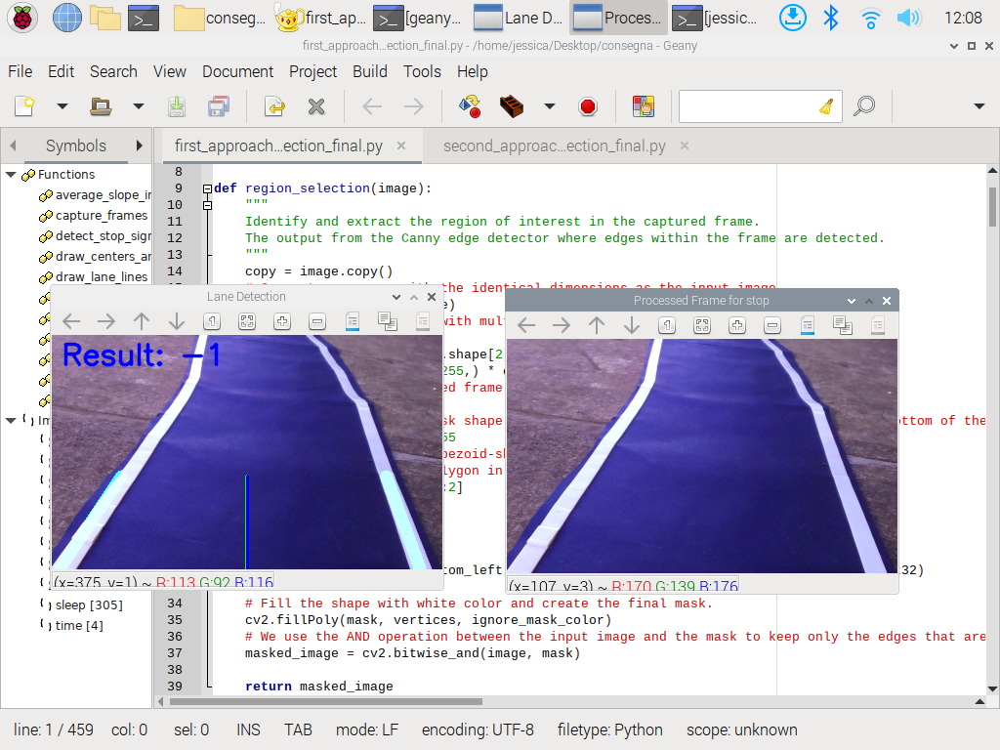
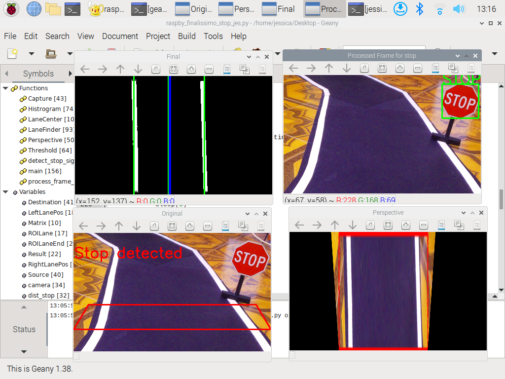
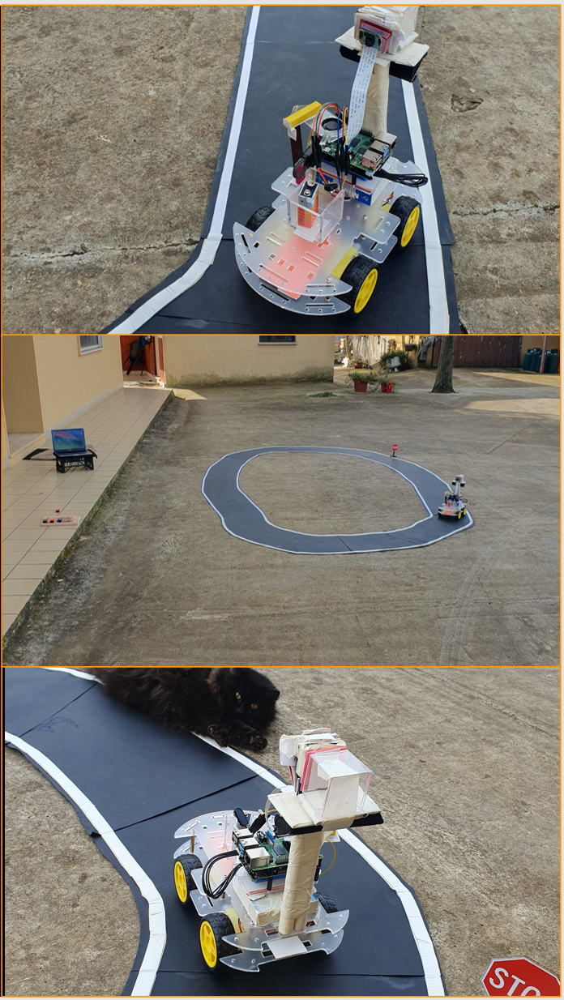

# 🚗 Raspby (the self driving car)

Welcome to the **Raspby (the self driving car)** project!  
This repository showcases our Computer Vision–based self-driving car prototype, developed using low-cost hardware and real-time image processing techniques.  

  

---

## 🌍 Introduction  

In recent years, self-driving cars have attracted significant interest. Designing systems capable of:  
- 🛣️ Identifying **road lanes**  
- 🛑 Recognizing **stop signs**  
- 🤖 Planning safe vehicle movements  

...can revolutionize urban mobility by:  
- ⏱️ Saving time & reducing stress  
- 🚦 Lowering traffic congestion  
- ♿ Offering accessible transportation for elderly and disabled individuals  

---

## 🛠️ Hardware Components  

The core of our self-driving prototype is a set of affordable yet powerful components:  

- 🍓 **Raspberry Pi 4B** – the brain of the vehicle  
- 📷 **Picamera module v2** – real-time vision  
- ⚡ **L298N Motor Controller** – managing motor movements  
- 🚙 **Robot car chassis with DC motors** – mobility foundation  

Additional components include:  
- 🔋 Two separate batteries (Pi & motor controller)  
- 🌬️ Cooling fan (to prevent overheating)  
- 🧵 Jumper wires (component communication)  

  

---

## 💻 Software Implementation  

The entire software stack was written in **Python**, mainly using **OpenCV**.  
We structured the implementation around **two main approaches for lane detection** and a **dedicated stop sign detection module**.  

---

### 🛣️ Lane Detection – **First Approach (Edge & Line-Based)**  

This approach was inspired by the 2022 paper:  
[*“A Lane Detection Using Image Processing Technique for Two-Lane Road”*](https://ieeexplore.ieee.org/document/10001801)

**Pipeline:**  
1. 🎞️ **Grayscale conversion** → reduces color complexity  
2. 🌫️ **Gaussian Blur** → removes noise, smooths image  
3. ✂️ **Canny Edge Detection** → identifies sharp changes in intensity (possible lane edges)  
4. 🔲 **Region of Interest Masking** → focuses only on the road section  
5. ➖ **Hough Line Transform** → extracts continuous lane lines from fragmented edges  

**Movement Planning:**  
- Lane center is computed and compared to frame center  
- A **“Result” score** determines the offset  
- Vehicle movement strategy:  
  - Move left ↔ Move right ↔ Go forward  
  - Adjust intensity of correction based on score

 

**Limitations:**  
- Requires **optimal lighting conditions** (struggles with artificial light)  
- Vehicle must travel at **low speeds** to ensure processing accuracy  
- Sensitive to road texture and shadows  

---

### 🦅 Lane Detection – **Second Approach (Bird’s Eye View & Histogram-Based)**  

To overcome the limitations of the first method, we introduced a **Bird’s Eye View (BEV)** perspective.  

**Pipeline:**  
1. 🔺 **Perspective Transform** → trapezoidal road region → rectangular BEV  
2. 🎞️ **Grayscale conversion**  
3. ⛔ **Thresholding + Edge Detection** → highlights lane lines in BEV frame  
4. 📊 **Histogram Analysis** →  
   - Scans along horizontal axis  
   - Peaks in histogram = probable lane line positions  
5. ➡️ Lane center estimation, offset calculation, and movement control

**Advantages over first approach:**  
- Works well under **artificial lighting**  
- Allows **higher vehicle speeds** while maintaining detection accuracy  
- More robust to environmental changes  

**Movement Planning:**  
- Similar to first approach (Result score + corrective actions)  
- Smoother trajectory corrections due to histogram-based line detection  

---

### 🛑 Stop Sign Detection  

Based on the 2021 paper:  
[*“Traffic sign detection optimization using color and shape segmentation as a pre-processing system”*](https://www.researchgate.net/publication/348929926_Traffic_sign_detection_optimization_using_color_and_shape_segmentation_as_pre-processing_system)

**Pipeline:**  
1. 🌫️ **Gaussian Blur** → enhances color regions, smooths noise  
2. 🎨 **HSV Thresholding** → isolates red color regions  
3. 🔧 **Morphological Operations** (dilation & erosion) → reduce noise, refine shapes  
4. 🔲 **Contour Detection** → extracts object outlines  
5. 📐 **Douglas-Peucker Algorithm** → simplifies contours to straight-line approximations  
6. 🛑 **Shape Recognition**:  
   - If contour has 8 sides → **classified as octagon** → STOP sign detected

  

**Result:**  
When a stop sign is detected, the system sends a **signal to halt vehicle motion immediately**.  

---

## 🎥 Demonstrations  

- ✅ First approach [demo video](https://drive.google.com/file/d/126eiOTjoHAptE4GLCWDK46c3gz_tiYP8/view?usp=sharing) 
- ✅ Second approach [demo video](https://drive.google.com/file/d/1PBrDn75TPqP8LFdaFnNGDCb4t0HhhivI/view?usp=sharing)
- ✅ Stop sign detection [demo video](https://drive.google.com/file/d/1jok9Hye-KthrxMDBxpfsi2PTSviN67pi/view?usp=sharing)
- ✅ full [demo video](https://drive.google.com/file/d/1YwUV-BCrDXmLjAUlwhwBtw2TmvMYzy4v/view?usp=sharing)

---

## 📚 Research References  

- **Lane Detection** → *"A Lane Detection Using Image Processing Technique for Two-Lane Road"* (2022)  
- **Stop Sign Detection** → *"Traffic sign detection optimization using color and shape segmentation as a pre-processing system"* (2021)  

---

## Authors
- [@Pnlalessio](https://github.com/Pnlalessio)  
- [@JessicaFrabotta](https://github.com/JessicaFrabotta)
--- 
